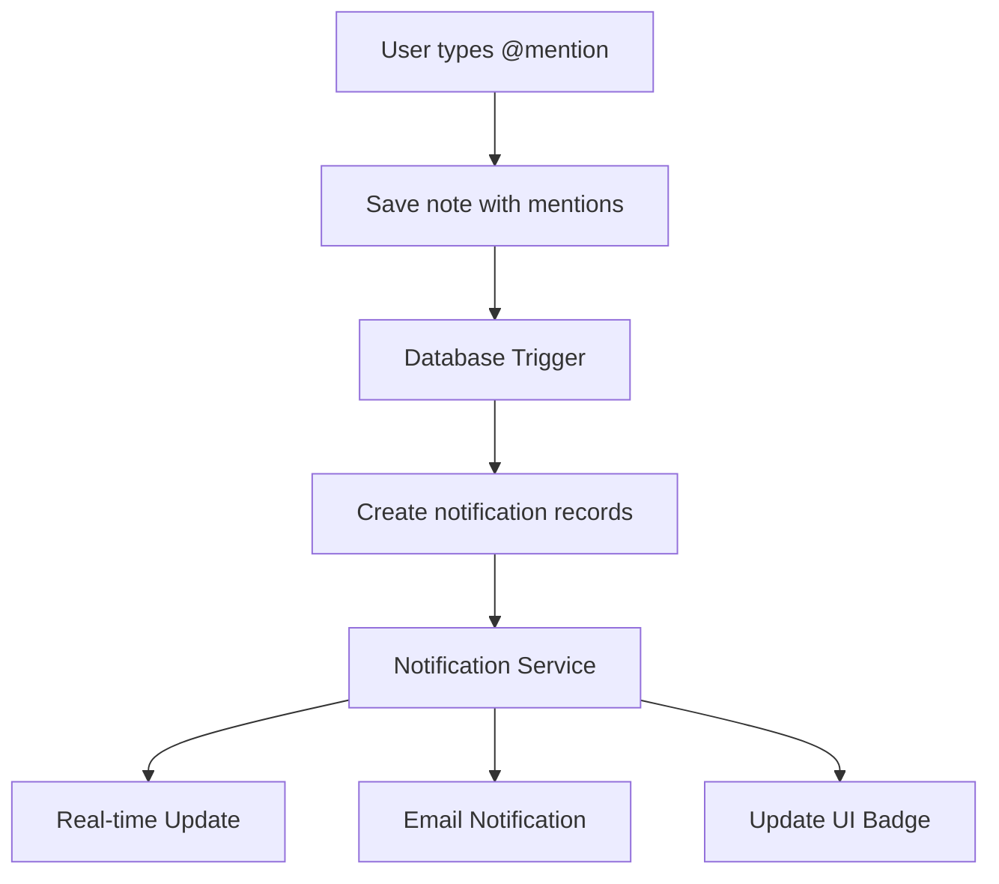

# Mention Notification System Design

## Overview
When a user is mentioned in an internal note using the `@` symbol, the system needs to notify the mentioned user through multiple channels and maintain a record of these notifications.

## User Experience
When a user is mentioned, they should:

1. **Immediate Notification**
   - Receive a real-time notification if online
   - Get an email notification (if enabled)
   - See a notification badge in their UI

2. **Notification Content**
   - Mentioner's identity (who mentioned them)
   - Ticket context (which ticket)
   - Content/context of the mention
   - Direct link to the ticket

## Database Schema

### Internal Notes Table
```sql
ALTER TABLE internal_notes
ADD COLUMN mentions TEXT[]; -- Array of user IDs or emails who were mentioned
```

### Notifications Table
```sql
CREATE TABLE notifications (
    id UUID PRIMARY KEY DEFAULT uuid_generate_v4(),
    user_id UUID NOT NULL REFERENCES auth.users(id),
    type VARCHAR(50) NOT NULL, -- e.g., 'mention'
    source_type VARCHAR(50) NOT NULL, -- e.g., 'internal_note'
    source_id UUID NOT NULL, -- ID of the internal note
    ticket_id UUID NOT NULL REFERENCES tickets(id),
    content TEXT, -- Optional notification message
    created_at TIMESTAMPTZ DEFAULT NOW(),
    read_at TIMESTAMPTZ, -- NULL if unread
    FOREIGN KEY (source_id) REFERENCES internal_notes(id)
);

CREATE INDEX idx_notifications_user_id ON notifications(user_id);
CREATE INDEX idx_notifications_read_at ON notifications(read_at);
```

## Process Flow



### Detailed Flow
1. User creates/edits note with @mentions
2. Backend validates and saves note
3. Database trigger fires on mention column update
4. Notification records created for each mentioned user
5. Notification service processes new records:
   - Pushes real-time updates via WebSocket
   - Sends emails if enabled
   - Updates notification counts in UI

## Implementation Considerations

### Frontend
- Mention suggestion dropdown
- Real-time notification badge
- Notification center UI
- Mark as read functionality

### Backend
- WebSocket connection for real-time updates
- Email service integration
- Rate limiting for notifications
- Batch processing for multiple mentions

### Security
- Validate mention permissions
- Ensure users can only see notifications meant for them
- Rate limit mention capabilities
- Sanitize notification content

## Future Enhancements
1. Notification preferences per user
2. Different notification types (email, in-app, etc.)
3. Batch notifications
4. Rich text in notifications
5. Mobile push notifications 